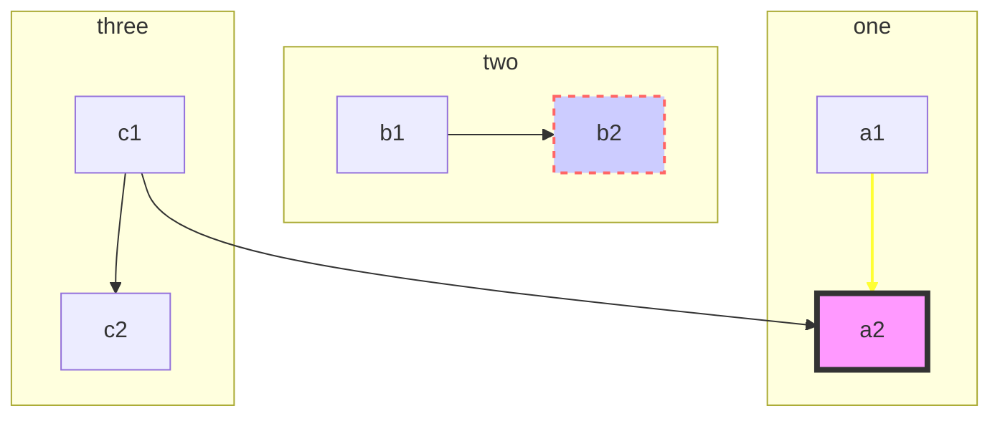
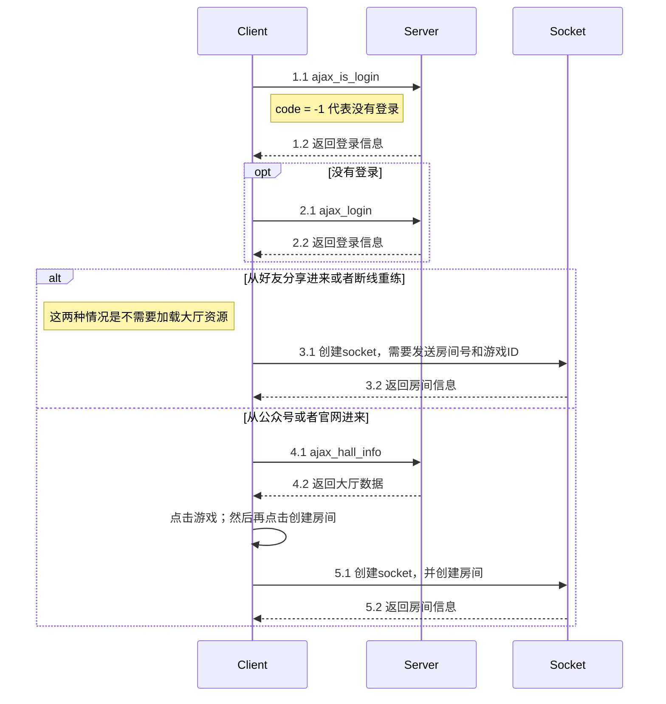
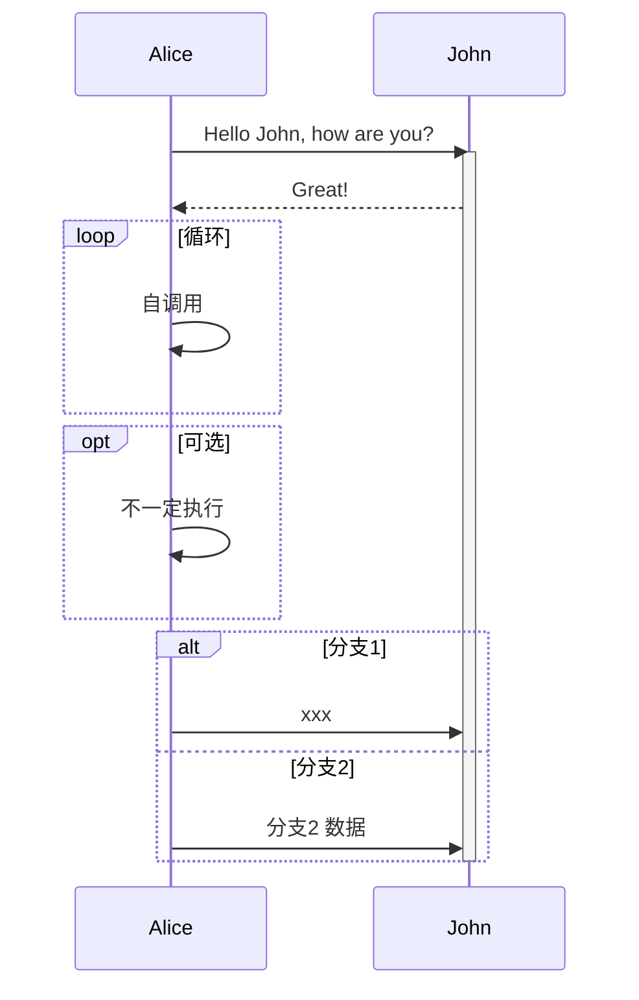

# Markdown 示例 
### mind map
```jsmind
{
    "name":"三公",
    "children":
    [
        { 
        "name":"客户端" , 
        "children":
            [
                {"name":"登录模块"},
                {"name":"绑定", "children": [
                    {"name": "美术", "ok": 1},
                    {"name": "程序", "ok": 1},
                    {"name": "验收"}
                ]},
                {"name":"签到" },
                {"name":"....." }
            ] 
        },

        { 
        "name":"服务端" , 
        "children":
            [
                {"name":"微信支付" },
                {"name":"绑定1" },
                {"name":"验收" }
            ] 
        }
    ]
}
```
### graph


linkStyle 0 stroke:#ff3,stroke-width:4px,fill:none;
linkStyle 0 图连线样式，从 0 开始，对应图中的线
### 时序图

### 带控制焦点 activate, deactivate

### json，带语法检查
```json
{
    "no": 1,
    "ano": 1
}
```

### test
i am a test
```js
{
    "no": 2
    "an": 2 //我是注释
}
```


### 合并表格
<table class="table table-bordered">

 <tr><td>登录/注册</td><td>签到前置条件，需要对接奥飞通行证</td></tr>
<tr><td>表情选择</td><td>展示8个角色表情供用户选择（单选）</td></tr>
<tr><td>短语选择</td><td>展示若干条动画片短语供用户选择（单选）</td></tr>
<tr><td>签到用户展示</td><td>瀑布流展示方式，每页20条当日最新签到用户，用户点击签到后，用户数据展示到固定的位置。用户下次登录后，固定位置展示该用户的上次签到记录</td></tr>
<tr><td>签到记录归档</td><td>将每日签到记录生成一个帖子，标题为日期+签到记录帖，内容为当日签到记录</td></tr>
<tr><td>签到</td><td>用户点击签到按钮，提示签到成功，每日仅可签到一次，再次点击提示已经进行过签到操作</td></tr>
<tr><td>签到奖励</td><td>用户点击签到按钮，根据签到情况奖励一定的积分</td></tr>
<tr><td>额外签到奖励</td><td>根据规则，每日符合规则的用户签到，奖励额外的积分</td></tr>

 <tr>
    <th rowspan="11">基础签到奖励规则</th>
 </tr>
 <tr><td>每日奖励分值按照下方描述进行发放，如果中断需要重新开始</td></tr>
<tr><td>累计一天奖励1积分</td></tr>
<tr><td>累计两天奖励2积分</td></tr>
<tr><td>累计三天奖励4积分</td></tr>
<tr><td>累计四天奖励5积分</td></tr>
<tr><td>累计五天奖励6积分</td></tr>
<tr><td>累计六天-十天奖励8积分</td></tr>
<tr><td>累计十一天-第二十天奖励12积分</td></tr>
<tr><td>累计二十一天以上15积分</td></tr>
<tr><td>累计三十一天以上20积分</td></tr>
<tr>
    <th rowspan="9">额外签到奖励规则</th>
 </tr>
 <tr><td>每日中奖用户，当日应获得积分X3</td></tr>
<tr><td>星期一，当天签到的第1、10、19、100、110、199、210、310、410、510名，奖励积分X3</td></tr>
<tr><td>星期二，当天签到的第2、20、29、200、220、299、320、420、520、620名，奖励积分X3</td></tr>
<tr><td>星期三，当天签到的第3、30、39、300、330、399、430、530、630、730名，奖励积分X3</td></tr>
<tr><td>星期四，当天签到的第4、40、49、400、440、499、540、640、740、840名，奖励积分X3</td></tr>
<tr><td>星期五，当天签到的第5、50、59、500、550、599、650、750、850、950名，奖励积分X3</td></tr>
<tr><td>星期六，当天签到的第1、10、20、30、40、50、60、70、80、90、100名，奖励积分X3</td></tr>
<tr><td>星期日，当天签到的第1、10、20、30、40、50、60、70、80、90、100名，奖励积分X3</td></tr>

 </table>
![test pic][1]

[1]: ./pic/game_exit.png


[网页链接](https://www.baidu.com/)